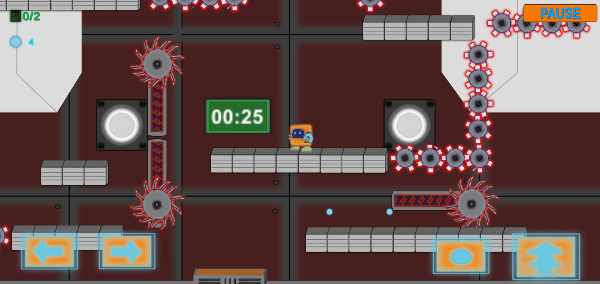
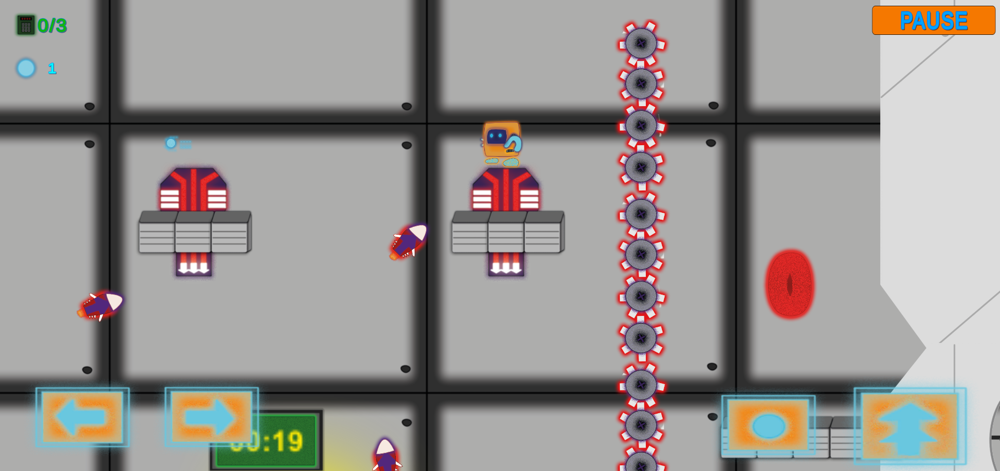

#  2D Platformer Prototype (Unity)

A playable 2D platformer prototype developed with Unity, focused on core gameplay mechanics such as movement, traps, key collection, and level interaction.

##  Project Background

This project was originally developed in 2023 as one of my early Unity projects.
It is not a fully completed commercial game, but a functional prototype created to practice platformer mechanics, obstacle design, and level flow.

##  Implemented Features

* Character movement (run and jump)
* Trap and obstacle mechanics
* Key collection system
* Exit / level goal logic
* Core level gameplay loop
* Basic UI elements

##  Technical Highlights

* Unity 2D physics-based gameplay
* Collision-triggered interactions
* Scene-based prototype structure
* Early gameplay systems implementation in C#

##  Prototype Goal

This project was built to explore and practice:

* core platformer movement
* obstacle interaction
* level objective design
* basic gameplay flow structure

##  Gameplay

## 🚀 How to Run

1. Open the project in Unity Hub
2. Open an available gameplay scene
3. Press Play

##  Tech Stack

* Unity (2D)
* C#
* Visual Studio

##  Notes

This repository is an early Unity prototype and is intended to showcase foundational gameplay programming rather than a fully finished game.
